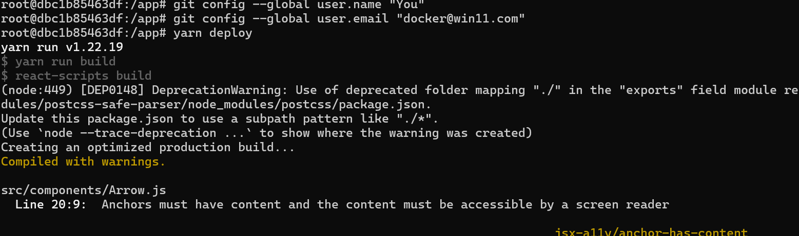
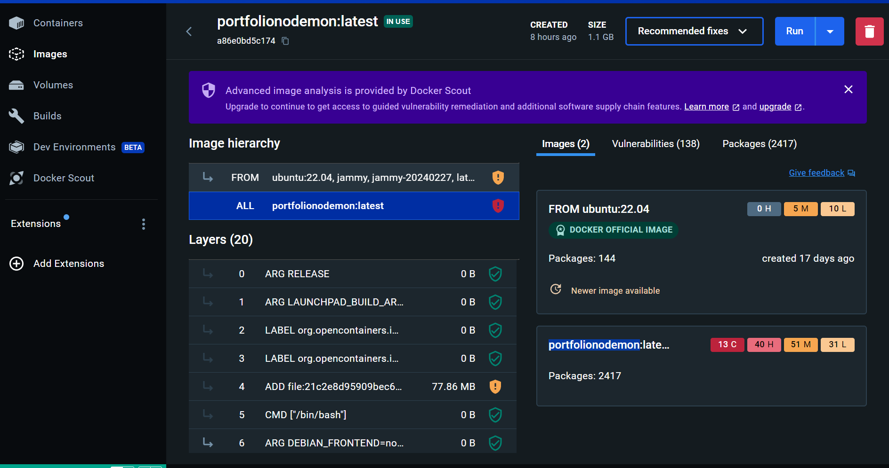
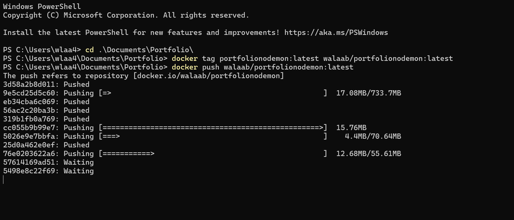
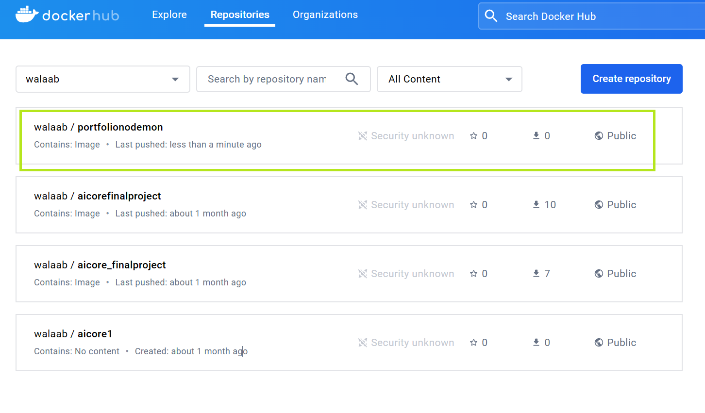

# WalaaWill Portfolio

Welcome to the official repository of my professional portfolio. This space is dedicated to showcasing the projects and achievements that underline my journey in the realms of AI, Robotics, and technological innovation. Through this repository, I aim to share the insights and experiences that have shaped my career, hoping to inspire and contribute to the community of future innovators.

## Table of Contents


# Table of Contents

- [WalaaWill Portfolio](#walaawill-portfolio)
  - [Table of Contents](#table-of-contents)
- [Table of Contents](#table-of-contents-1)
  - [About Me](#about-me)
  - [Projects Overview](#projects-overview)
    - [RL \& Cognitive Robot](#rl--cognitive-robot)
    - [Jackal Robot Sim](#jackal-robot-sim)
    - [AI \& ML Python Projects](#ai--ml-python-projects)
    - [Project Management](#project-management)
  - [Education and Experience](#education-and-experience)
  - [Awards and Recognitions](#awards-and-recognitions)
  - [Getting Started](#getting-started)
    - [Prerequisites](#prerequisites)
  - [Installation](#installation)
      - [Running Without a Container](#running-without-a-container)
      - [Running With a Container](#running-with-a-container)
  - [React Application Docker Setup (Deeper Dive in Docker)](#react-application-docker-setup-deeper-dive-in-docker)
      - [Dockerfile Explanation](#dockerfile-explanation)
  - [Building the Docker Image](#building-the-docker-image)
  - [Running the Container for Development](#running-the-container-for-development)
  - [Making Changes](#making-changes)
- [Project Deployment Guide](#project-deployment-guide)
  - [Setting Up SSH](#setting-up-ssh)
    - [Generating SSH Keys](#generating-ssh-keys)
    - [Adding SSH Key to GitHub](#adding-ssh-key-to-github)
  - [Configuring Git Identity](#configuring-git-identity)
    - [Setting Git Identity](#setting-git-identity)
  - [Deployment](#deployment)
  - [Deployment from the Container](#deployment-from-the-container)
  - [Docker Image Backup and Deployment](#docker-image-backup-and-deployment)
  - [Protecting Your Design](#protecting-your-design)
  - [Advanced Projects and Research](#advanced-projects-and-research)
    - [Enhancing Autonomous Robotics with Cognitive RL](#enhancing-autonomous-robotics-with-cognitive-rl)
    - [Aviation Control System Enhancement](#aviation-control-system-enhancement)
    - [Smart Cities and IoT](#smart-cities-and-iot)
  - [Tools and Technologies](#tools-and-technologies)
  - [Tools and Technologies](#tools-and-technologies-1)
  - [Contributions and Community Engagement](#contributions-and-community-engagement)
    - [Open Source Projects](#open-source-projects)
    - [Publications and Presentations](#publications-and-presentations)
    - [Workshops and Seminars](#workshops-and-seminars)
  - [Looking Ahead](#looking-ahead)
  - [How to Contribute](#how-to-contribute)
    - [Reporting Issues](#reporting-issues)
  - [License](#license)
  - [Acknowledgments](#acknowledgments)
  - [Contact Information](#contact-information)
  - [Skills and Tools](#skills-and-tools)
  - [Work Experience Highlights](#work-experience-highlights)
  - [Key Projects and Achievements](#key-projects-and-achievements)
  - [Education](#education)
  - [Achievements](#achievements)
    - [Workshops and Seminars](#workshops-and-seminars-1)
  - [Looking Ahead](#looking-ahead-1)
  - [How to Contribute](#how-to-contribute-1)
    - [Reporting Issues](#reporting-issues-1)
  - [License](#license-1)
  - [Acknowledgments](#acknowledgments-1)
  - [Contact Information](#contact-information-1)


## About Me

I'm Will, an impassioned AI and Robotics Innovator with a deep-seated commitment to pushing the boundaries of what's possible. From a solid foundation in Electronics and Telecom to advanced explorations in AI and Robotics, my journey is a testament to the power of continuous learning and innovation. London has been both a home and a crucible for my development, where the complex dance of numbers and algorithms finds expression in projects that span the spectrum from cognitive robotics to advanced data visualization.

## Projects Overview

This portfolio is a window into a variety of projects that exemplify my approach to solving problems at the intersection of technology and real-world applications. Each project is an exploration of how AI and Robotics can be leveraged to create impactful, innovative solutions.

### RL & Cognitive Robot
Merging cognitive learning with reinforcement learning to enhance multi-agent robotics for better localization and sim2real adaptation.

### Jackal Robot Sim
A detailed simulation environment for the Jackal robot, fostering research and learning in robotics through hands-on experience in SLAM mapping and autonomous navigation.

### AI & ML Python Projects
A suite of Python projects demonstrating the application of AI and ML in solving complex problems, from pathfinding algorithms to prediction models.

### Project Management
Overseeing the lifecycle of over 100 projects, highlighting my skills in steering projects from conception through to execution and maintenance.

## Education and Experience

Detailing my academic background and professional experience, this section underscores the foundational knowledge and practical skills that inform my work.

## Awards and Recognitions

Showcasing the milestones and accolades that mark my journey, including the first prize at City Spark for an AI VR math education startup.

## Getting Started

To explore the projects and code samples included in this repository, follow the installation guide below to set up the environment on your local machine.

### Prerequisites

Before you begin, ensure you have the following installed:
- Git
- Python 3.x
- Node.js


## Installation

This portfolio can be run with or without a container. Below are the instructions for both methods, including a note on potential issues with Windows OS and the importance of using Node.js version 16.

#### Running Without a Container

1. **Clone the repository**:
   ```bash
   git clone git@github.com:wlaa41/Portfolio.git
   ```

2. **Navigate to the project directory**:
   ```bash
   cd Portfolio
   ```

3. **Install the necessary dependencies** (Ensure Node.js version 16 is installed):
   ```bash
   npm install
   npm install --save-dev sass
   ```

4. **Start the development server**:
   ```bash
   npm start
   ```
   This will launch the project in your default web browser.

*Note for Windows users*: Running the project directly on Windows may lead to potential issues. It is recommended to use a container or Windows Subsystem for Linux (WSL) for a smoother experience.

#### Running With a Container

Using Docker or any compatible container platform can streamline the setup process and mitigate environment-specific issues, especially on Windows.

1. **Build the container image** (Ensure Docker is installed and running):
   ```bash
   docker build -t portfolio .
   ```

2. **Run the container**:
   ```bash
   docker run -p 3000:3000 portfolio
   ```
   Access the portfolio by navigating to `http://localhost:3000` in your web browser.

*Important*: The container version uses Node.js version 16, aligning with the project's dependencies. Ensure that any additional dependencies or environment-specific configurations are accounted for in the Dockerfile or container setup.

---

Regardless of the method chosen, `npm install --save-dev sass` is crucial for proper styling compilation. Ensure this step is not overlooked during setup.


## React Application Docker Setup (Deeper Dive in Docker)

This guide outlines how to containerize a React application using Docker, emphasizing live reloading capabilities during development with hot reloading supported by React Hot Loader and ensuring file change detection with CHOKIDAR_USEPOLLING.

#### Dockerfile Explanation

The Dockerfile sets up an Ubuntu 22.04 environment, installs Node.js, Yarn, and other necessary packages. It uses an environment variable to improve file watching in Docker environments, particularly useful for development on platforms where file change events do not automatically propagate to Docker containers.

```Dockerfile
# Use Ubuntu 22.04 as the base image
FROM ubuntu:22.04

# Avoid prompts from apt during installation
ARG DEBIAN_FRONTEND=noninteractive

# Install Node.js (including npm) and other necessary packages
RUN apt-get update && apt-get install -y curl && \
    curl -fsSL https://deb.nodesource.com/setup_16.x | bash - && \
    apt-get install -y nodejs && \
    apt-get clean && \
    rm -rf /var/lib/apt/lists/*

# Install Yarn
RUN curl -sS https://dl.yarnpkg.com/debian/pubkey.gpg | apt-key add - && \
    echo "deb https://dl.yarnpkg.com/debian/ stable main" | tee /etc/apt/sources.list.d/yarn.list && \
    apt-get update && apt-get install -y yarn

# Set the working directory in the container
WORKDIR /app

# Install application dependencies
RUN apt-get update && apt-get install -y git && \
    npm install react@16 react-dom@16 react-player && \
    npm install --save-dev sass

# Use polling for file system events for compatibility in Docker
ENV CHOKIDAR_USEPOLLING=true

# Copy the local application files to the container
COPY . /app

# Expose the port the app runs on
EXPOSE 3000

# Command to run the application
CMD ["npm", "start"]
```

## Building the Docker Image

To build your Docker image, navigate to the directory containing your Dockerfile and run:

```bash
docker build -t <image-name> .
```

Replace `<image-name>` with your preferred name for the Docker image.

## Running the Container for Development

To run your container and enable live reloading during development, use the following command:

```bash
docker run -v ${PWD}:/app -v /app/node_modules -p 3000:3000 <image-name>
```

This command mounts your current working directory to `/app` in the container and creates an anonymous volume for `/app/node_modules`, ensuring that the container uses its own `node_modules` and not the host's. This setup is crucial for live reloading to work properly.

`ENV CHOKIDAR_USEPOLLING=true` ensures that file watching works correctly across all development environments, especially necessary for Docker on Windows and macOS.

## Making Changes

With the container running, any changes made to your files will trigger a reload in your React application, allowing you to see updates in real-time.

---

This setup provides a robust environment for developing React applications with Docker, leveraging the best practices for live reloading and efficient development workflows.

# Project Deployment Guide

This guide provides essential steps for setting up SSH and Git configurations required for deploying your project, especially when working within a Docker container.

## Setting Up SSH

SSH (Secure Shell) is vital for secure communication with repositories hosted on platforms like GitHub. It's particularly crucial when pushing changes or deploying projects from within Docker containers.

### Generating SSH Keys

1. **Open a terminal** in your Docker container or local environment where you need to generate SSH keys.
2. **Generate a new SSH key pair** with the following command:
   ```bash
   ssh-keygen -t ed25519 -C "your_email@example.com"
   ```
   Replace `your_email@example.com` with your email address. Press Enter to accept default file locations and enter a passphrase if desired.

3. **Start the ssh-agent in the background**:
   ```bash
   eval "$(ssh-agent -s)"
   ```

4. **Add your SSH private key to the ssh-agent**:
   ```bash
   ssh-add ~/.ssh/id_ed25519
   ```

### Adding SSH Key to GitHub

1. **Copy the SSH public key to your clipboard**:
   ```bash
   cat ~/.ssh/id_ed25519.pub
   ```
   Then manually copy the displayed key.

2. **Go to GitHub** and navigate to **Settings > SSH and GPG keys > New SSH key**.

3. **Paste your key**, give it a title, and **Add SSH key**.

## Configuring Git Identity

Git requires user identity configuration to associate commits with an individual. This setup is necessary for operations that interact with a Git repository.

### Setting Git Identity

Run the following commands in your Docker container or local environment where you're setting up your project:

1. **Set your Git user name**:
   ```bash
   git config --global user.name "Your Name"
   ```

2. **Set your Git email address**:
   ```bash
   git config --global user.email "you@example.com"
   ```

Replace `"Your Name"` with your actual name and `"you@example.com"` with your email address. These should align with your GitHub account for consistency with GitHub commits.

## Deployment

With SSH and Git configurations set, you're ready to deploy your project. Follow your project-specific deployment instructions, ensuring any operations that require Git or SSH access are now properly authenticated.


## Deployment from the Container

To deploy your application from within the container, follow these steps. This procedure also applies to local deployment from your machine.

1. **Open a new terminal in the container or your local machine**:

You can find the name of the container by runing the command

```bash
docker ps
```
Note: the container name is not the image name.

Then run the command:

```bash
docker exec -it <container_name_or_id> /bin/bash
```

First, ensure you're in the project's root directory. If you're using a container, you might need to attach to your running container or use a terminal within your container management platform.

1. **Build your application**:

Run the following command to compile your application into a static build that can be deployed:

```bash
npm run build
```

This command compiles your application into a `build` directory, containing the static files necessary for deployment.

3. **Deploy your application**:

With your application built, use Yarn to deploy your application to your hosting service:

```bash
yarn deploy
```



Ensure you have previously configured your hosting service (like GitHub Pages, Netlify, or Vercel) to pick up the static files from the `build` directory for deployment.

*Note*: Both `npm run build` and `yarn deploy` are standard commands for React applications. However, your specific deployment command (`yarn deploy`) may vary based on your hosting provider or deployment setup. Adjust this command based on your deployment process or scripts defined in your `package.json`.


## Docker Image Backup and Deployment

I have successfully backed up a fully operational Docker container that runs perfectly on Windows. This container is set up to deploy and build efficiently. Here's how I accomplished this:

1. **Local Container Execution**:

   I started by running the Docker container on my local Windows machine using Docker Desktop to ensure everything was functioning correctly.

   

2. **Pushing the Image to Docker Hub**:

   To back up the container, I tagged it with my Docker Hub username, `walaab`, and pushed it to the repository.

   ```bash
   docker tag portfolionodemon:latest walaab/portfolionodemon:latest
   docker push walaab/portfolionodemon:latest
   ```

   The push process was visualized in the PowerShell window, confirming that the layers were being uploaded sequentially.

   

3. **Confirmation on Docker Hub**:

   After pushing the image, I verified on Docker Hub that the image was now stored in the repository named `portfolionodemon`. This serves as a perfect backup and is ready for deployment whenever needed.

   

You can find the Docker image and the respective backups in my Docker Hub repository at `https://hub.docker.com/r/walaab/portfolionodemon`.

The entire process is documented and verified, showing the effectiveness of using Docker Desktop on Windows to manage container images.

---

## Protecting Your Design

If you wish to protect the designs and concepts within your project, ensuring that individuals or entities seek your permission before using them, consider the following approaches:

1. **License**: Clearly define the licensing for your project in your `LICENSE.md` file. While you can use a standard license (like MIT, GPL, etc.), you can also create a custom license that specifies the need for explicit permission for certain uses of your work.

2. **Contribution Guidelines**: In your `CONTRIBUTING.md` file or a similar section within your README, explicitly state that while contributions are welcome, any use of the project's design, assets, or code for commercial purposes requires prior approval.

3. **Contact Information**: Make sure your README includes clear contact information for inquiries. This encourages anyone interested in using your design or components of your project for their purposes to reach out to you directly for permission.


## Advanced Projects and Research

In this section, I delve into some of the more complex projects and research endeavors that have defined my work in AI and Robotics. These projects not only highlight my technical skills but also my ability to tackle challenging problems and innovate solutions.

### Enhancing Autonomous Robotics with Cognitive RL

My PhD research focuses on enhancing the capabilities of autonomous robotics within multi-agent systems through the integration of cognitive learning and reinforcement learning. This work aims to improve localization, adaptability, and collaboration among robots, making them more effective in real-world tasks.

### Aviation Control System Enhancement

In collaboration with aviation experts, I've worked on optimizing control systems for aircraft. By applying linearized models and the Jacobian matrix, we've been able to enhance the stability and performance of flight systems, contributing to safer and more reliable air travel.

### Smart Cities and IoT

As a Manager & R&D Manager at a leading Smart Cities company, I've led initiatives to integrate IoT technologies into urban infrastructure, resulting in improved efficiency, safety, and quality of life. This work involves developing and deploying smart systems for traffic management, security, and energy conservation.

## Tools and Technologies


## Tools and Technologies

My work spans a wide range of tools and technologies that are pivotal to the fields of AI, machine learning, and robotics. These include, but are not limited to:

- **Programming Languages**: Proficient in Python, JavaScript, HTML, and C#. My projects leverage these languages for backend development, frontend interfaces, and machine learning algorithms.
- **Containerization and Automation**: Experienced with Docker and Kubernetes for containerization, along with Terraform and Ansible for automation. These tools ensure efficient deployment and management of applications across various environments.
- **Cloud and DevOps**: Utilizing Azure and Azure DevOps for cloud computing and CI/CD pipelines, enhancing project delivery speed and reliability. Prometheus is used for monitoring and ensuring the performance of applications.
- **Machine Learning and AI**: Deep knowledge of TensorFlow, PyTorch, CNNs, Reinforcement Learning (RL), and Artificial Neural Networks (ANN). These frameworks and concepts form the backbone of my AI projects, enabling sophisticated data analysis and prediction models.
- **Robotics**: Hands-on experience with cameras, LiDARs, IMUs, GNSS, and ground truth systems such as motion capture and 3D scanning, critical for robotics navigation and environmental interaction.
- **Modeling and Visualization**: Skilled in using Sketchup, AutoCAD, SolidWorks for 3D modeling, alongside ThreeJS, Panda, and Plotly for data visualization, bringing clarity to complex data and concepts.
- **Certifications and Specializations**: I am certified in KNX for building automation and continue to enhance my expertise through ongoing education in fields such as DevOps Engineering and AI and Machine Learning.


## Contributions and Community Engagement

I believe strongly in the value of sharing knowledge and contributing to the community. This section details my involvement in open-source projects, publications, and presentations at conferences, as well as workshops and seminars I've led to disseminate knowledge in AI and Robotics.

### Open Source Projects

My contributions to open-source projects, including enhancements to existing frameworks and the development of new tools and libraries that support AI and Robotics research and development.

### Publications and Presentations

A list of my publications in peer-reviewed journals and conferences, covering a range of topics from cognitive robotics to machine learning applications in smart cities.

### Workshops and Seminars

Information on workshops and seminars I've organized or participated in, aimed at educating and inspiring others in the fields of AI, machine learning, and robotics.

## Looking Ahead

As I continue my journey in AI and Robotics, I remain committed to exploring new horizons and pushing the boundaries of technology. My ongoing research and project work aim to contribute to the advancement of autonomous systems and their application in improving human life and environmental sustainability.

I look forward to collaborating with peers, industry leaders, and communities to create innovative solutions that address global challenges. The path ahead is filled with opportunities for growth, learning, and impact, and I am excited to see where it leads.

For inquiries, collaborations, or more information, please feel free to contact me at walaa.jamous@city.ac.uk.

## How to Contribute

I welcome contributions from the community, whether they are suggestions for improvements, bug reports, or contributions to the code. If you're interested in contributing, please follow these steps:

1. **Fork the repository**: Create your own copy of the repository to work on.
2. **Create a new branch**: Make your changes in a new branch off of the main branch.
3. **Submit a pull request**: Once your changes are complete, submit a pull request to merge your changes back into the main repository. Please provide a detailed description of your changes and the impact they have.

### Reporting Issues

If you encounter any issues or have suggestions for improvements, please submit them through the GitHub issue tracker for this repository. Your feedback is invaluable in making this resource more useful for everyone.

## License

This project is licensed under the MIT License - see the [LICENSE.md](LICENSE.md) file for details. This means you are free to use, modify, and distribute the projects contained herein, provided that you include the original copyright and permission notice in all copies or substantial portions of the software.

## Acknowledgments

- Hat tip to everyone who has contributed to this project, whether through direct code contributions, issues, or feature suggestions.
- Special thanks to the academic and professional mentors who have guided my journey in AI and Robotics.
- Appreciation to the open-source community for providing the tools and frameworks that have made much of this work possible.

## Contact Information

For any inquiries or further discussion about the projects and technologies mentioned in this portfolio, please don't hesitate to reach out. I am always open to discussing new ideas, potential collaborations, or opportunities to contribute to exciting projects.

**Email**: walaa.jamous@city.ac.uk

Thank you for taking the time to explore my portfolio. I look forward to the possibility of working together to push the boundaries of what's possible in AI and Robotics.

---

*This README is a living document and may be updated as new projects are added or existing ones are enhanced. Be sure to check back regularly for the latest developments.*


## Skills and Tools

- **Programming Languages and Tools**: Python, JavaScript, HTML, C#, Docker, Kubernetes, Terraform, Ansible, Azure, Azure DevOps, git, GitHub, Prometheus, TensorFlow, Pytorch, CNNs, RL, ANN, KNX, Control4, MATLAB.
- **Robotics**: Experience with Cameras, LiDARs, IMUs, GNSS, and ground truth systems like motion capture and 3D scanning.
- **Modeling and Visualization**: Skilled in Sketchup, AutoCAD, SolidWorks, ThreeJS, Panda, and Plotly.
- **Certifications**: BSc Electrical Engineering, Hashicorp Terraform Associate (in progress), DevOps Engineering (AiCore), PG in Artificial Intelligence and Machine Learning (City University of London), KNX Engineer.

## Work Experience Highlights

- **Appitunity (R&D Manager, 01/2018 – 01/2022)**: Led 30+ digital marketing projects, significantly increasing web traffic and conversion rates. Managed large teams and coordinated cross-functional efforts in complex technical environments.

## Key Projects and Achievements

- **Smart Home Automation Projects (12/2019)**: Directed 100+ luxury smart home projects, utilizing DALI, KNX, and C-Bus systems. Tripled sales through effective marketing strategies and high-quality YouTube content.
- **Azure DevOps Pipeline (11/2023)**: Demonstrated proficiency in containerization, Azure resource deployments, and CI/CD processes, significantly enhancing deployment efficiency.
- **Unicampus Gazebo Simulation with Jackal Robot (11/2023)**: Created a detailed simulation environment, emphasizing expertise in robotics, SLAM, and autonomous navigation.
- **SLAM and LiDAR Projects (06/2023)**: Focused on navigation and mapping, showcasing a strong foundation in autonomous systems and data analysis.
- **Advanced Mosaicking Image Processing Library (03/2022)**: Developed using OpenCV-Python, demonstrating skills in image processing and deployment via Docker.
- **System Dynamics and Stability Analysis Project (03/2022)**: Investigated RPV dynamics and analyzed stability, leveraging MATLAB for simulation and analysis.

## Education

- **PhD in Robotics, AI, and Autonomous Systems (City University of London, Expected 02/2025)**: Focusing on advanced mathematics and machine learning models.
- **MSc in Artificial Intelligence and Machine Learning (City University of London, 02/2022)**: Mastered generative AI, deep learning, CNNs, and reinforcement learning.
- **BSc Electronic Engineering (International Open University, 07/2013)**: Specialized in embedded systems design, automation, and control systems.

## Achievements

- **1st Place CitySpark Startup Competition (2022)**: For innovative concepts in AI education.
- **Pioneering Home Automation Projects**: Over 100 projects integrating advanced AI technologies.

### Workshops and Seminars

Information on workshops and seminars I've organized or participated in, aimed at educating and inspiring others in the fields of AI, machine learning, and robotics.

## Looking Ahead

As I continue my journey in AI and Robotics, I remain committed to exploring new horizons and pushing the boundaries of technology. My ongoing research and project work aim to contribute to the advancement of autonomous systems and their application in improving human life and environmental sustainability.

I look forward to collaborating with peers, industry leaders, and communities to create innovative solutions that address global challenges. The path ahead is filled with opportunities for growth, learning, and impact, and I am excited to see where it leads.

For inquiries, collaborations, or more information, please feel free to contact me at walaa.jamous@city.ac.uk.

## How to Contribute

I welcome contributions from the community, whether they are suggestions for improvements, bug reports, or contributions to the code. If you're interested in contributing, please follow these steps:

1. **Fork the repository**: Create your own copy of the repository to work on.
2. **Create a new branch**: Make your changes in a new branch off of the main branch.
3. **Submit a pull request**: Once your changes are complete, submit a pull request to merge your changes back into the main repository. Please provide a detailed description of your changes and the impact they have.

### Reporting Issues

If you encounter any issues or have suggestions for improvements, please submit them through the GitHub issue tracker for this repository. Your feedback is invaluable in making this resource more useful for everyone.

## License

This project is licensed under the MIT License - see the [LICENSE.md](LICENSE.md) file for details. This means you are free to use, modify, and distribute the projects contained herein, provided that you include the original copyright and permission notice in all copies or substantial portions of the software.

## Acknowledgments

- Hat tip to everyone who has contributed to this project, whether through direct code contributions, issues, or feature suggestions.
- Special thanks to the academic and professional mentors who have guided my journey in AI and Robotics.
- Appreciation to the open-source community for providing the tools and frameworks that have made much of this work possible.

## Contact Information

For any inquiries or further discussion about the projects and technologies mentioned in this portfolio, please don't hesitate to reach out. I am always open to discussing new ideas, potential collaborations, or opportunities to contribute to exciting projects.

**Email**: walaa.jamous@city.ac.uk

Thank you for taking the time to explore my portfolio. I look forward to the possibility of working together to push the boundaries of what's possible in AI and Robotics.

